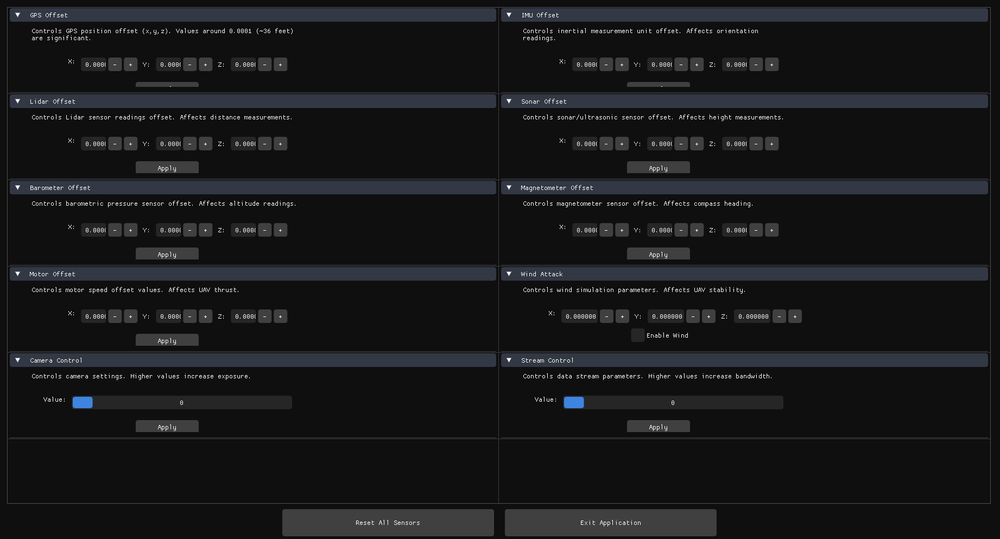

# UAViSec-A Simulation Platform for Intelligent UAV Cybersecurity and Reliability Analysis

Demo Videos of UAV security simulation examples using this platform are available at: https://www.youtube.com/@uavisec/videos


## Setup
The following steps are required in order to run the PX4 flight simulation software. This repository contains the code in order to collect data, run attacks, and run normal/attacked simulations with flight plans.
1. Clone the repository
    * https://github.com/ai-uavsec/UAViSec (this repo)
    * https://github.com/PX4/PX4-Autopilot

2. Install and build PX4 Gazebo-Classic
	* https://docs.px4.io/main/en/sim_gazebo_classic/
3. Install QGroundControl
	* http://qgroundcontrol.com/
4. Replace Plugins and build PX4 Tools
	1. Place `/bin/*` into `Tools/simulation/gazebo-classic/sitl_gazebo-classic/` to overwrite the default SITL-Gazebo-Classic plugins.
 	2. Place `/px4/*` into `src/modules/simulation/simulator_mavlink/` to overwrite the px4_simulation file.
	3.  Rebuild the PX4-Autopilot software
 	4.  Place `/spoofer/sensor/*.pb.cc` and `/spoofer/sensor/*.pb.h` into `$PX4/Firmware/build/px4_sitl_default/build_gazebo-classic/` 
    
  
    ```console
	  make px4_sitl gazebo-classic
	  ```
  Alternatively, the `install.sh` script can be used to perform these actions.
    ```console
      chmod +x install.sh
      ./install.sh <PX4 root directory>
    ```

  5. Clone ImGui
    ```console
      cd spoofer
      git clone https://github.com/ocornut/imgui.git
    ```
	5. Build tools
	  ```console
	  cd CLONED_REPOSITORY/spoofer
	  chmod +x ./build.sh
	  ./build.sh
	  ```

## Tools
The following tools are located within the `CLONED_REPOSITORY/spoofer/build` directory.
* **spoofer.cc**\
    Perform different types of sensor attacks\
    The scale for each parameter are as follows:
     0.0001 ~= 36 feet
     0.00001 ~= 3.6 feet
     0.000001 ~= 4 inches
    * **Absolute Offset**\
      Change the GPS Attack parameters to change the offset of the latitude and longitude in degrees, and the altitude in meters.
        ```console
        ./spoofer -abs <latitude:double> <longitude:double> <altitude:double>
        ```
    * **Rotation Offset**\
      Change the GPS Attack parameters to change the offset by a particular degree amount.
        ```console
        ./spoofer -rot <degrees:double> <rotation:double>
        ```
    * **Imu offset**\
      Change the IMU Attack parameters to change the bias by a particular
      ```console
      ./spoofer -imu <option: int > <index:int > <offset:double>

      <option>: 1 : attack On.
                2 : disable the imu, set all data to 0.
                3 : input the offset value into the attack temp array. it won't be applied to the attack unless the attack On.
                4 : empty the array.
                5 : stop the imu attack.

      <index>:  0: Linear acceleration X
                1: Linear Acceleartion Y
                2: Linear Acceleartion Z
                3: Angular Velocity X
                4: Angular Velocity Y
                5: Angular Velocity Z
      <offset>

      e.x.:
      ./spoofer -imu 3 2 2.0     //give a 2.0 increment offset to the Linear Acceleartion of Z. Save in the temp imu increment array.
      ./spoofer -imu 1 2 2.0    //start the imu attack,with the offset data saved in last step.
      ./spoofer -imu 5 2 2.0    //stop the attack.
      ./spoofer -imu 4 2 2.0    //free the attack temp data.
      ```
    * **Stream simulation**\
      Influence the live stream frame, like flip and add noise into the figure capture by camera.

      ```console
      ./spoofer -stream <option>

      <option>: 1:  flip the stream camera.
                2:  Add a noise to the center area of the picture.

                Further work, it will be updated to change the pixel value of the area at the specified position on the screen.
      ```


    * **Motor Offset**\
      Change the Motor speed in the simulator which will backward influence the autopilot motor outputs performance
      ```console
      ./spoofer -motor <option:int>  <index : int> <thrust speed:int>

      <option> :
        1 : attack input On/Off.
        2 : disable all the motor
        0 : stop the attack

      <index>  : index of the motors

      <thrust speed> : 0 ~ max thrust speed = 1450.

      e.x.: ./spoofer -motor 1 0 500      	  //start the attack the #0 motor with speed 500.
            ./spoofer -motor 2 0 0      	  //make all the motor speed to 0
      ```
    * **Magnetometer Spoof**\
      Change the Magnetometer attack parameters to change the amount of the magnetometer. Swap the x, y axis of the Magnetic field data

      ```console
      ./spoofer -mag <option:int>

      <option>: 1: swap the magnetic_field.x()  with  magnetic_field.y()
      ```


    * **Lidar Offset**\
      Change the lidar sensor data with a constant offset (distance sensor)

      ```console
      ./spoofer -lidar <option : int> <distance_offset : double>

      <option> :  1 : Attack On/Off
      <distance_offset>: the distance sensor has a range of [0.17,15.0] m. The distance sensor will display none after the reading exceeds 15 meters.
      ```
    * **Sonar Offset**\
      Change the Sonar sensor data with a constant offset (distance sensor)

      ```console
      ./spoofer -sonar <option : int> <distance_offset : double>

      <option> :  1 : Attack On/Off
      <distance_offset>: the distance sensor has a range of [0.02,5.0] m. The sonar distance sensor only reflects the object within its maximum distance. If there
      is nothing, the current distance equals to the max distance.
      ```

    * **Barometer Offset**\
      Change the altitude Attack parameters to change the offset by a particular absolute altitude and then it will auto change the absolute pressure and the temperature data computed by the new altitude.

      ```console
      ./spoofer -baro <option:int> <offset : double>

      <option>:  1: Attack On/Off
      <offset>:   the offset data you want the sensor make.
* **Custom usage tips**\
    The UI is shown below:
    
    To apply an attack, press the "apply" button after changing the values. Multiple attacks can be launched simultaneously.
    The "reset all sensors" button disables any attacks that you have launched.
    
  	When use the camera test, you should use the Typhoon-h480 model with world you like, such as ksql_airport.world.
  	To use the camera and stream, you need to enable the video in QGroundControl. You can follow this link to set up stream in QGroundControl.
      * https://docs.px4.io/main/en/sim_gazebo_classic/#how-to-view-gazebo-video

  	``` console
   	make px4_sitl gazebo-classic_typhoon_h480__ksql_airport
   	```
   	Test the lidar distance sensor Attack, you can use the iris_irlock model. It contains a downward depth camera.
  	```console
   	make px4_sitl gazebo-classic_iris_irlock
   	```
   	After the attack, you can observe the data changing in the QGroundControl-> Analyze Tools -> MAVLink Inspector: Distance Sensor
  
## Citation
 ```
@INPROCEEDINGS{UAVISEC,
  	author={Yang, Boyin and Li, Yanyan and and Callaghan, Ryan and Song, Houbing and Yuan, Jiawei},
  	booktitle={2025 International Conference on Unmanned Aircraft Systems (ICUAS)}, 
  	title={A Simulation Platform for Intelligent UAV Cybersecurity and Reliability Analysis}, 
  	year={2025}
  }
  

